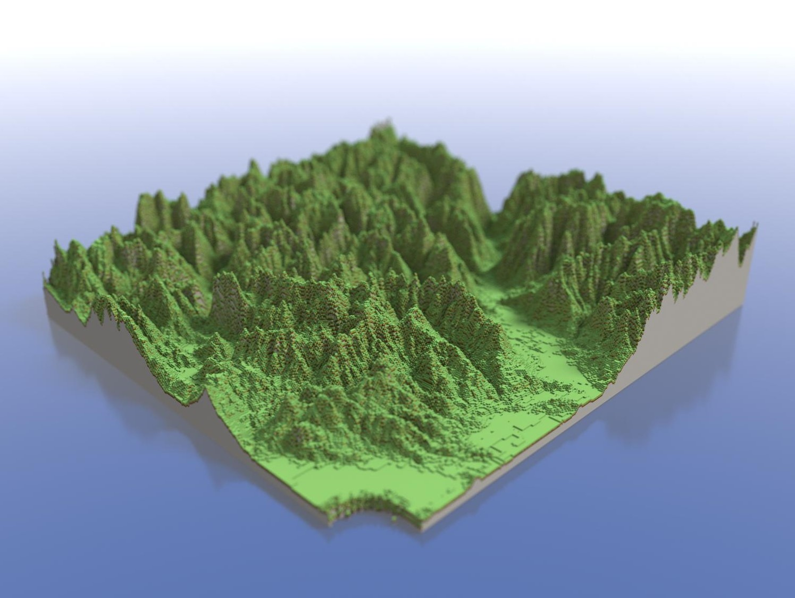
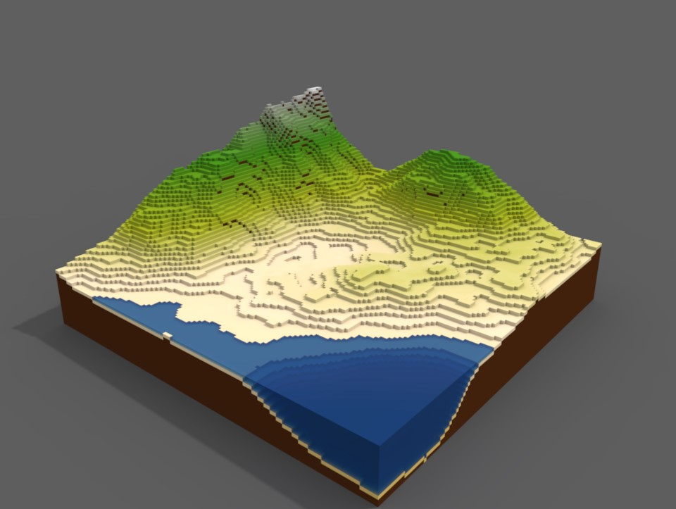
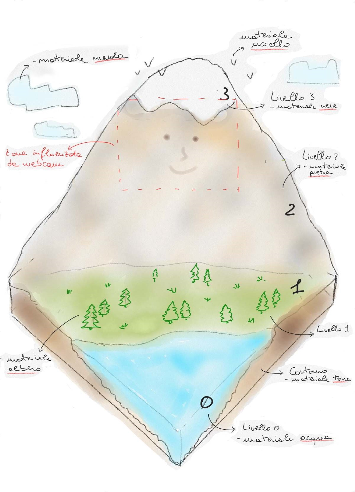
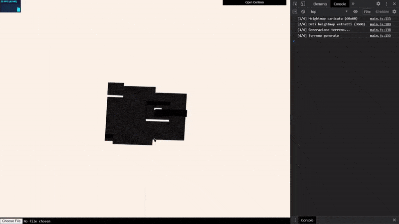
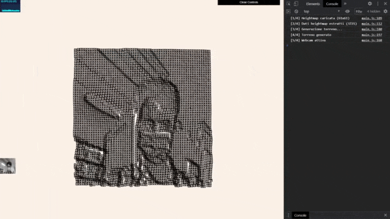
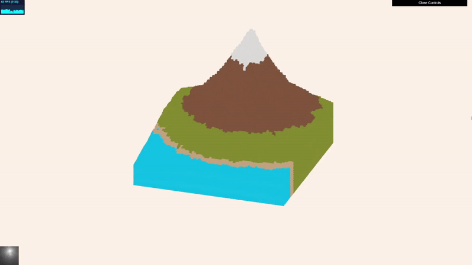
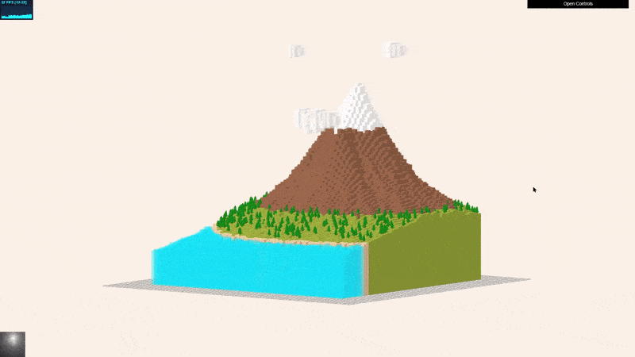

# Journal

## 4 novembre 2020
* **Idea 1**: __*Scultura volto con webcam su monti generati proceduralmente.*__ 
\
Piccolo scenario montuoso in proiezione ortogonale costruito mediante una heightmap, avendo in mente di mappare la superficie del monte con i livelli di grigio dell'immagine della webcam. L'obiettivo sarebbe quello di creare delle piccole scene nei monti la scultura del proprio volto. Da ponderare meglio. Possibilità di Download GLTF per stampa 3D? 
\
**Animazioni**: fauna (uccelli), effetti ambientali (nuvole,...), ecc.
\
**Problema**: Dubbi sulla generazione con heightmap e poi modifica con analisi dell'immagine. Come garantire spazio sufficiente per il volto? Invece dei livelli di grigio della webcam forse sarebbe meglio inserire un sistema di face recognition? La densità dei cubi deve essere sufficiente a permettere un livello di dettaglio del volto soddisfacente.
\
**Ispirazione**: Costruire una sorta di Monte Rushmore ambientato nelle Dolomiti.
\
\

* **Idea 2**: __*Generazione palla di neve da webcam*__ 
\
Si disegna a mano una heightmap. La si mostra alla webcam. Viene generato il terreno che è inserito in una palla di neve. Esplorazione di effetti particellari (neve, ...).

L'idea 1, forse, mi aggrada di più.
* Sketch  
    

* **Da fare:**
    - [ ] **Test** di validità dell'idea
    - [ ] **Costruire** terreno proceduralmente
    - [ ] **Acquisire** immagine da webcam
    - [ ] **Trasformare** i cubi del monte in base all'immagine (se c'è tempo pensare ad una soluzione con face recognition, forse)

## 5 novembre 2020
* **Problema**: test di generazione procedurale completo. Con una heightmap di 60x60 (3600 cubi) le prestazioni non sono soddisfacenti. E non è ancora stato aggiunto nient'altro! Con una risoluzione così bassa è impossibile inserire l'immagine dalla webcam. Serve una risoluzione di più alta. Perché Three.js ha prestazioni così basse? Problemi nel mio codice?
\
 **Idea di soluzione**: utilizzare una heightmap piccola, scena a bassa risoluzione e aggiungere una maschera di PlaneGeometry con una risoluzione maggiore, sarà questa a inserire la scena. Oppure vedi InstancedMesh.

* **Fatto**:
    - [x] **Test** di validità dell'idea
        - [x] testare webcam con cubi su scena a bassa risoluzione
        - [ ] se risultato non soddisfacente, testare prestazioni con scena bassa risoluzione e PlaneGeometry ad alta risoluzione
* Il risultato non è soddisfacente. Metto in pausa lo sviluppo della webcam.

* Risultati della costruzione del terreno da heightmap, anche disegnate a mano
   

* Risultati della trasformazione del terreno in base all'immagine della webcam
   

* **Da fare**:
    - [ ] Refactoring

## 6 novembre 2020
* **Fatto**:
    * Aggiunte le texture in base all'altezza.
        
    * Aggiunta funzionalità di download modello GLTF (copia incollate da [smanettamento precedente](https://github.com/christiancorro/3D-spectrogram))
* **Problema**: quando un cubo viene scalato la texture viene deformata.
* **Problema**: l'immagine della webcam era ben visibile con il materiale wireframe. Ora che ci sono le texture è molto meno percettibile.
\
**Idea di soluzione**: mescolare i colori della webcam con i colori del materiale. Bah
* **Da fare**: 
    - [ ] costruire le nuvole
    - [ ] costruire gli uccelli (caricare da oggetti?)

## 7 novembre 2020
* **Idea**: 
    * aggiungere animazione onde all'acqua
    * merge della funzionalità per fare l'upload della heightmap
* Heightmaps trovate [qui](https://forums.newtek.com/showthread.php/152437-Terrain-party-free-website-to-extract-heightmaps?p)

* **Fatto**:
    - [x] generazione automatica/animazione delle nuvole
    - [x] generazione automatica alberi
    - [x] animazione dell'acqua

* **Risultati**:
        

* **Da fare**: 
    - [ ] generazione automatica degli uccelli
    - [ ] urge un profondo refactoring
    - [ ] Individuare zona rocciosa su cui scolpire la webcam, inserire in un array e trasformare i cubi. O provare con PlaneBufferGeometry

## 9 novembre 2020
* **Fatto**:
    - [x] generazione automatica degli uccelli
    - [x] ridimensionamento automatico delle heightmap caricate
    - [x] gestione delle altezze dei materiali parametrica (ora si possono modificare con la gui)
    - [x] refactoring
    
* **Risultati**:
        

* **Da fare**:
    - [ ] animazione del terreno con webcam
